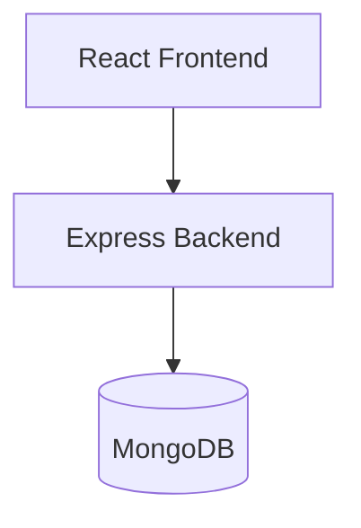
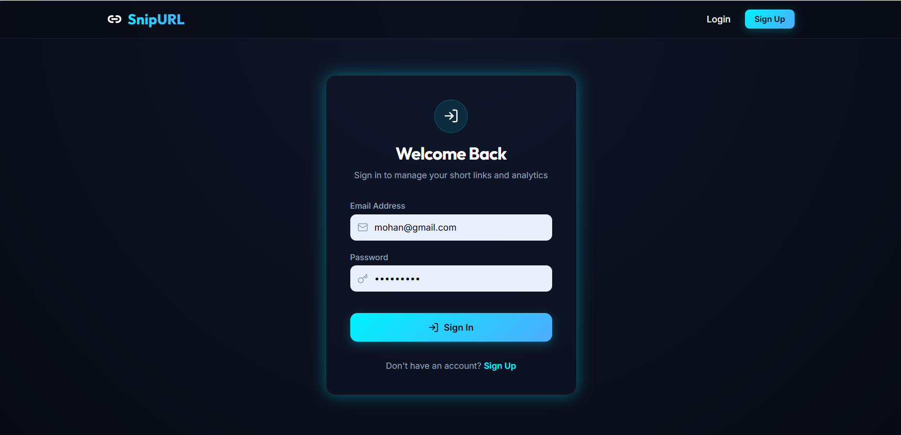
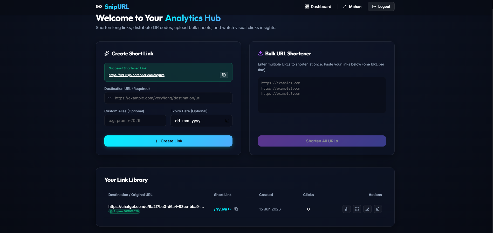
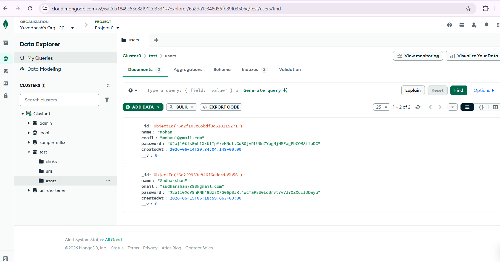
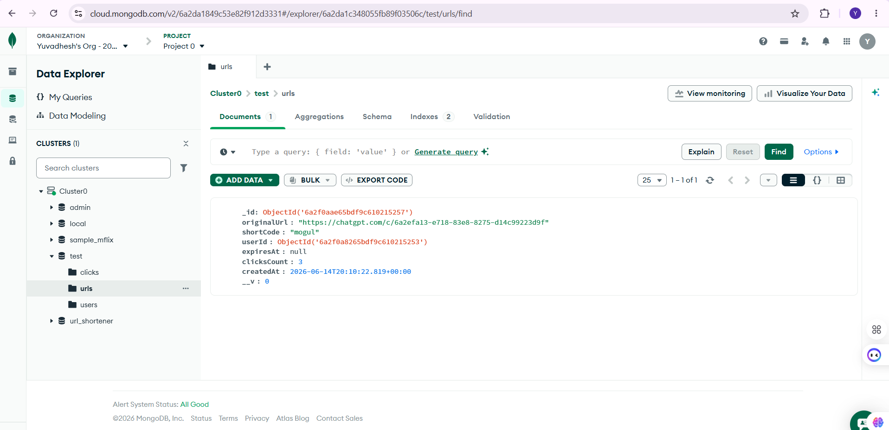
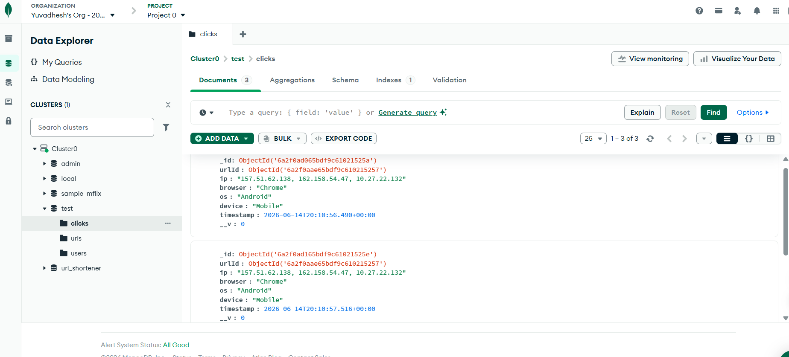

# SnipURL – Premium URL Shortener & Click Analytics

A full-stack URL Shortener application that allows users to create short links, manage URLs, track analytics, generate QR codes, create custom aliases, upload URLs in bulk, and monitor link performance through a modern dashboard.

---

# 📌 Problem Statement

Managing long URLs is inconvenient and difficult to share. Users also lack visibility into how their links perform after sharing.

SnipURL solves this by providing:

* Secure user authentication
* Custom URL shortening
* Analytics tracking
* QR code generation
* Bulk URL creation
* Public statistics pages

---

# 🧠 AI Planning Document

## Problem

Users need a simple platform to shorten URLs and monitor engagement through analytics.

## Solution

Build a secure URL shortening platform where authenticated users can:

* Create short URLs
* Track click analytics
* Generate QR codes
* Manage all links from a dashboard

## Workflow

User → React Frontend → Express Backend → MongoDB Database

---

# 🤖 AI Tools Used

- ChatGPT

AI was used for:

- Planning the application architecture
- Generating boilerplate code
- Debugging backend and frontend issues
- Improving UI/UX design
- Creating project documentation

All AI-generated code was reviewed, modified, tested, and fully understood before submission.

---

# ✨ Features

## 🔒 Authentication

* User Signup
* User Login
* JWT Authentication
* Protected Routes
* Password Hashing using bcryptjs

## 🔗 URL Shortening

* Create Short URLs
* Unique Short Code Generation
* Custom Alias Support
* URL Validation
* Expiry Date Support
* Server-side Redirect Handling

## 📊 Analytics

* Total Click Count
* Last Visited Time
* Recent Visit History
* Device Analytics
* Browser Analytics
* Operating System Analytics
* Daily Click Trends

## 🛠 Advanced Features

* QR Code Generation
* Edit Destination URL
* Delete URL
* Bulk URL Shortening
* Public Stats Page
* Responsive Dashboard
* Toast Notifications

---

# 🏗️ Architecture Diagram



---

# 🛠️ Tech Stack

## Frontend

* React
* Vite
* React Router
* Axios

## Backend

* Node.js
* Express.js
* JWT
* bcryptjs

## Database

* MongoDB
* Mongoose

---

# 🔌 API Endpoints

## Authentication

### Register User

```http
POST /api/auth/signup
```

### Login User

```http
POST /api/auth/login
```

### Get Current User

```http
GET /api/auth/me
```

## URL Management

### Create Short URL

```http
POST /api/urls/shorten
```

### Get All User URLs

```http
GET /api/urls
```

### Update URL

```http
PUT /api/urls/:id
```

### Delete URL

```http
DELETE /api/urls/:id
```

### Redirect to Original URL

```http
GET /r/:shortCode
```

### Get URL Analytics

```http
GET /api/urls/:id/analytics
```

---

# 📝 Assumptions Made

1. MongoDB runs locally on port 27017.
2. Users must authenticate before accessing the dashboard.
3. Analytics data is stored in MongoDB.
4. Custom aliases must be unique.
5. Expired links cannot be accessed.

---

# 🌐 Live Demo

https://url-weld-five.vercel.app/login

---
# 🚀 Setup Instructions

## Clone Repository

```bash
git clone https://github.com/yuvadhesh/URL.git
cd URL
```

## Backend Setup 

```bash
cd server
npm install
npm start
```

Create a `.env` file:

```env
PORT=5000
MONGO_URI=mongodb://127.0.0.1:27017/url_shortener
JWT_SECRET=your_secret_key
CLIENT_URL=http://localhost:5173
```

## Frontend Setup

```bash
cd client
npm install
npm run dev
```

Open:

```text
http://localhost:5173
```

---

# 📷 Screenshots

## Login Page



## Dashboard



## Analytics Page


## QR Code Generator


---

# 🗄️ Sample Database Entries

## Users Collection




## URLs Collection




## Clicks Collection




---

# 📋 Backend Logs

```text
MongoDB Connected
Server running on port 5000

POST /api/auth/login
User Login: demo@gmail.com

POST /api/urls/shorten
Short URL Created: yuva

GET /r/yuva

Click Recorded
```

---

# 🎥 Demonstration Video

Video Link:

https://youtu.be/tr2hBu_M2WM?si=uvaKTv7HYmdgE_q4

---

# 📄 Future Enhancements

* Geolocation Analytics
* Team Collaboration
* API Key Access
* Custom Domains
* Advanced Reporting

---

This project is a part of a hackathon run by https://katomaran.com
